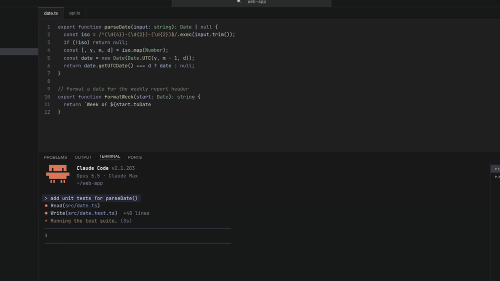

# island

**English** | [简体中文](README.zh-CN.md)

A macOS menu-bar app that watches the AI agents running on your machine — Claude Code, Codex, pi, and the Claude desktop app — and drops a Dynamic-Island-style panel from the top of the screen the moment one of them finishes a task. Click a task and you land right back in the terminal tab, tmux pane, VS Code terminal, or desktop conversation it came from.

Stop checking five terminals to see who's done.



▶ 60-second intro video: *(YouTube link coming soon)*

> **Status: MVP.** The app shell (overlay, global hotkey, menu bar, launch at login, hotkey settings) is done; agent detection and the overlay UX are under active development. See `hai/PLAN.md`.

## Install

```bash
brew install lbyxiafei/tap/island
```

Upgrade with `brew upgrade island`, uninstall with `brew uninstall island` (`brew uninstall --zap island` also removes settings). The app is signed and notarized — just launch it from Applications.

Requires macOS 13+.

## Features

- **Detects finished agent runs**: Claude Code (terminal), Claude desktop app (chat), pi (terminal), Codex (CLI + desktop). How each agent's completion signal, task identity, title, and host process are read is documented in `hai/reference/agents/README.md`
- **Pops up when a task finishes**, listing tasks (unread first, with a red dot); hovering pauses auto-hide
- **Meaningful titles**: the agent's own title when it has one, otherwise the **last message**, otherwise the directory name
- **Click to jump back** to the exact tab — the panel closes and you're taken to the task: tmux switches to the right session/window/pane; cmux / Ghostty / Terminal / iTerm2 switch to the right tab; VS Code switches to the right terminal tab (island installs a companion extension automatically, no setup); desktop apps open the conversation. When the task can't be located, the resume command (e.g. `claude --resume <id>`) is copied to the clipboard. macOS asks once for permission the first time island controls a given terminal app. Clicked tasks lose their red dot but stay in the list
- **Unread count in the menu bar**, plus the same task list in the menu (click to jump back)
- **Only runs that finish after island starts** are counted — history is ignored
- **Global hotkey `⌃⌘,`** summons the panel at the top center of the screen, **with no system permissions required** (no Input Monitoring / Accessibility prompts); press it again to dismiss
- Auto-popups hide after 5 seconds (configurable in `Settings…` → `Notifications`, or turn popups off entirely; hover pauses); a hotkey-summoned panel stays until you close it
- **Doesn't interrupt what you're looking at**: if the finished task's tab / window is already frontmost (current tmux pane, current cmux / Ghostty / Terminal / iTerm2 tab, current VS Code terminal, desktop app in front), there's no popup and no count — it's listed without a red dot. Switch to an unread task's window yourself and its red dot and count clear within seconds
- **Island look**: the panel hangs from the menu bar with large rounded bottom corners. Header: `● N new` on auto-popup (`All caught up` when nothing is unread); when summoned, the whole header is a search field with an `N new` pill. Each row: number keycap + agent icon (red dot on the icon when unread) + title + `directory • agent` + short time (now / 3m / 2h)
- **Keyboard-driven when summoned**: type to filter, `↑↓` to select, `↩` to open, `⌘1–9` to jump directly, `⌘,` for settings, `esc` or click elsewhere to close. Auto-popups never steal focus — mouse only
- `Settings…` has four tabs: `General` (hotkey) / `Appearance` (theme, keyboard hints) / `Notifications` (popups) / `Agents`
- `Settings…` → `Agents` lists every supported agent and scenario (e.g. Claude Code's terminal CLI / editor extension / inside the Claude app / SDK; Codex's desktop app / terminal CLI / `codex exec`), how each is detected, and what a click does. Every scenario and every agent can be turned off individually — disabled ones aren't counted, don't pop up, and don't appear in the list
- Themes: System (light Sand / dark Lagoon) / Lagoon / Coral / Sand / Midnight, applied instantly; keyboard hints can be hidden
- The panel never shows up in the window switcher
- Menu bar icon: see at a glance that it's running, summon manually, toggle or change the hotkey, toggle launch at login, quit
- The hotkey can be turned on / off at any time; turning it off releases the key combo to the system while keeping your setting
- Change the hotkey by **pressing the combo to record it** (no syntax to remember), with a one-click `Clear`
- Launch at login (`SMAppService`; can be turned off in System Settings → Login Items)

## Privacy

island only reads each agent's session / transcript files on your machine to tell whether a task has finished. It contains no network code at all — nothing is uploaded or collected.

## Build from source

Requires macOS 13+ and Xcode (verified on macOS 26.6.2 / Xcode 26.6 / Swift 6.3.3). Zero third-party dependencies. No Apple Developer account needed: without a certificate the app is ad-hoc signed (runs on your machine only).

```bash
git clone https://github.com/lbyxiafei/island.git
cd island

./scripts/build-app.sh      # build and bundle build/Island.app (signed with Developer ID if available, ad-hoc otherwise)
open build/Island.app       # launch, no log output

# or run in the foreground, with config and event logs in the terminal:
./build/Island.app/Contents/MacOS/Island
```

The panel pops up once on launch; use the hotkey to summon it again. To quit: menu bar island icon → `Quit island`, or `pkill -x Island`.

> For long-term use, copy `Island.app` into `/Applications` and launch it from there — the login item remembers the app's path, and the build directory gets disturbed by later builds or cleanups.

## Packaging a release

```bash
./scripts/release.sh 0.2.0  # -> build/dist/island-0.2.0.dmg, signed, notarized, stapled
./scripts/publish.sh 0.2.0  # release.sh + upload to the homebrew tap + update the cask + tag v0.2.0
```

The dmg and cask live in [`lbyxiafei/homebrew-tap`](https://github.com/lbyxiafei/homebrew-tap): the dmg is its Release `island-v<version>`, the cask is `Casks/island.rb`. Run `publish.sh` on a clean, pushed master.

This needs a `Developer ID Application` certificate in the keychain and a notarytool keychain profile (named `notary` by default; override with `ISLAND_NOTARY_PROFILE`). The script finishes by checking both app and dmg with `spctl` against Gatekeeper's rules; both should report `accepted, source=Notarized Developer ID`. Users then just open the dmg, drag Island into Applications, and launch it.

## Hotkey

Menu bar icon → `Settings…` → `General`: click the recorder and press the combo you want (it must include at least one of `⌘⌃⌥⇧`). `Apply` takes effect immediately and is remembered; `Clear` empties it and turns the hotkey off; `Reset to default` restores the built-in default. A failed rebind keeps the old hotkey.

The hotkey can also be disabled at any time, via the `Enabled` checkbox above the recorder or the `Summon hotkey` menu item (same effect; your setting is kept).

The hotkey is a toggle: pressing it while the panel is showing closes it immediately rather than restarting the 5-second timer (the menu's `Summon overlay` always shows).

Two other ways to set it — **in-app settings win**:

| Method | Notes |
|---|---|
| Menu bar icon → `Settings…` | Takes effect immediately and is remembered; invalid combos are rejected on the spot, and a broken rebind keeps the old hotkey |
| `ISLAND_HOTKEY` environment variable | Read at launch, handy for one-off trials; overridden by in-app settings |

The built-in default is `cmd+ctrl+,`. Clear the in-app setting to fall back to the environment variable or the default:

```bash
# restore the default hotkey and re-enable it
defaults delete com.commallama.island IslandHotkeyText
defaults delete com.commallama.island IslandHotkeyEnabled
```

Modifiers can be written as `cmd`/`command`/`⌘`, `ctrl`/`control`/`⌃`, `opt`/`option`/`alt`/`⌥`, `shift`/`⇧`; the key is a single US-layout character, or `space` / `tab` / `return` / `escape` (this syntax only matters for the environment variable / `defaults`; in-app recording doesn't need it).

## Configuration

Set via environment variables; no rebuild needed.

| Variable | Default | Description |
|---|---|---|
| `ISLAND_HOTKEY` | `cmd+ctrl+,` | Summon hotkey |
| `ISLAND_OVERLAY_SECONDS` | `5` | How long an auto-popup stays (a value set in `Settings…` wins) |
| `ISLAND_TASK_LIMIT` | `10` | Number of tasks shown in the panel |
| `ISLAND_AGENT_HOME` | `~` | Where agent session stores (`~/.claude`, `~/.pi`, `~/.codex`, …) are read from |

```bash
ISLAND_HOTKEY=cmd+shift+k ISLAND_OVERLAY_SECONDS=2 ./build/Island.app/Contents/MacOS/Island
```

Bad values don't crash: island falls back to the default and prints a `warning` to stderr. To check only how the config resolves:

```bash
./build/Island.app/Contents/MacOS/Island --print-config
```

See which finished runs island currently detects (no window, debugging only):

```bash
./build/Island.app/Contents/MacOS/Island --scan-agents        # each line carries a scenario id (e.g. claude-code.terminal); disabled ones are marked (off)
./build/Island.app/Contents/MacOS/Island --reopen-plan <pid>   # how island would jump back to a given agent process
```

## Menu bar

Click the island icon in the menu bar:

| Item | Action |
|---|---|
| `Summon overlay (⌃⌘,)` | Summon once manually (a fallback to the hotkey) |
| `Summon hotkey` | Turns the summon hotkey on / off; the checkmark reflects the real state |
| `hotkey ⌃⌘, · default` | The current hotkey and where it comes from (in-app setting / environment variable / default); shows `hotkey off` when disabled |
| `Settings…` | Tabs for recording, toggling and clearing the hotkey; panel theme; whether to pop up on completion and for how long; per-agent / per-scenario detection toggles |
| `Launch at login` | Launch-at-login toggle; the checkmark reflects the real system state |
| `Quit island` | Quit |

The number next to the icon is the count of unread agent tasks.

Login items can also be checked and toggled from the command line (you must call the executable inside the `.app` bundle):

```bash
./build/Island.app/Contents/MacOS/Island --login-item-status
./build/Island.app/Contents/MacOS/Island --login-item-enable
./build/Island.app/Contents/MacOS/Island --login-item-disable
```

After disabling, you can confirm in System Settings → General → Login Items.

## Development

```bash
make verify        # all gates: build / fmt / lint / test / coverage / cycles / issue-check
make help          # all available targets
swift test         # tests only
./scripts/demo.sh  # run island on fake agent sessions (for recording demos); --check prints what it detects
```

| File | Contents | Maintained by |
|---|---|---|
| `hai/PLAN.md` | goal / non-goal / scope / design / key decisions | human |
| `hai/CONTEXT.md` | setup / test / layout / conventions / gotchas, for AI agents | agent |
| `hai/ISSUES.md` | issue index, generated by `make issue-sync` | tooling |

The code has two layers: `Sources/IslandCore` (pure logic, no UI framework coupling, fully tested) and `Sources/Island` (AppKit / Carbon wiring).

Project docs under `hai/` are mostly written in Chinese.

## Support

island is free and MIT licensed. If it saves you time, you can [sponsor its development on GitHub](https://github.com/sponsors/lbyxiafei).

## License

[MIT](LICENSE)
