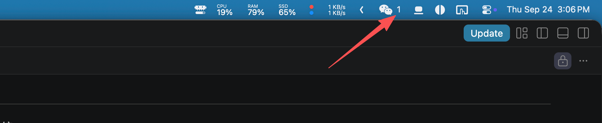

# PLAN

> 这份文件是本项目 scope 的唯一真源，**只由人修改**。
> Agent 发现它与现实脱节时，向人指出并等待确认，不得自行改写。

## Goal

我们要创建一个 app。该 app 会监视当前电脑的所有 AI AGENT 的运行活动，一旦检测到有 session/task 完成，会在屏幕中央上方 pop up 一个`悬浮窗`，里面是 AGENT 任务完成的总结。

当用户 hover 到浮窗上后，进入交互，浮窗会扩展并展示更多的在过去时间已完成的 sessions/tasks。

如果户在浮窗点击一个 session/task，根据 session/task 运行方式的不同，会有不同的交互：
1. 如果 session/task 是在已经打开的 terminal/ghostty/tmux/cmux/codex 的窗口内执行，那么交互结果是把窗口 pop up 到最前方即可。
2. 如果 session/task 是一个 background/daemon service，那么根据 AGENT 类型，把 session/task 的打开方式贴到 clipboard。例如：`pi --session 01a09864-466e-7336-bc20-c93637035001`。

浮窗在 session/task 完成后，pop up 5秒（可配置）后消失，同时，在任何时候，都有一个 global hot key，可以调出弹窗。

## Non-goal

1. 当前版本我们只考虑 `macOS` 情况，暂时不考虑其他操作系统。

## Scope

### 负责 Agents 范围

当前电脑（mac mimi），我们有以下几种 agents：
1. claude code 桌面版
2. claude code termianl版本（可以在：ghostty、terminal、iterms2、vscode 内）
3. pi terminal 版本（hosts 同#2）
4. codex 桌面版

我们要在对这些进行支持的同时，考虑未来的可扩展性 — 每一个本地 agent 的情况各不相同，我们一定会针对每种 agents 的情况，创建对应的 `computer use` 的 tool 进行信息读取（甚至 msg 传入，作为一个未来支持的方向），因此必然会创建一个通用中间层，来处理 tools 的交互，并将内容合理的展示在 island app 上。

## Design
 
### Settings

关于 settings 以及快捷键设置，详情参考 ## Version — POC。

### Agents 交互 interface

通用层面，我们对每一个 agent 要有以下功能
1. 扫描到 agent 完成任务的状态变化
2. get agent 任务的 id、title、last update ts、host process（桌面app、terminal、termianl in vscode等）
3. 根据 agent 任务的 host process + id：
   - 直接打开（如果任务不是background process），并打开到对应窗口（claude code的对话窗口很多，如果能找到对应的对话并打开，就是完美解决方案）
   - 如果无法直接打开，那么打开host process/app作为second best
   - 如果是terminal类型，那么也是尽量打开到指定窗口，这里就比较复杂了，要求程序还能检测到tmux的窗口情况并找到对应open window，似乎不太现实，需要调研下
   - 如果terminal类型无法找到已经打开的window，那么就把打开指令放到 clipboard。

### Island 展示 UX

我们只检测增量 agents，即这个电脑上的历史agents run，我们不 care。
因此，当一个新的 agent 任务跑完，island 需要在 menu bar 上展示一个数字，例如微信这种：

当用户 toggle on 悬浮窗，task 的 title 就会展示在上面，如果用户点击悬浮窗，就按照交互的interface所述继续。
同时，没有点击过的悬浮窗的task，左侧有一个红点点的未读标记，一旦通过 island 点击 task title 后，标记消失，但是 title 还是依旧会留在悬浮窗。

悬浮窗展示 N 条（N可以在setting定义，default 10条），排序有两个维度：
1. 未读/未打开 -> 已读/已打开
2. 按 last update ts 倒叙

### Island 下拉框 UX

1. 下拉框的task，有title显示title，没有title显示last msg（现在似乎也是这么实现的？）
2. 当我点击下拉框的title后，下拉框随即消失/toggle off

### Menu bar UX

## Key Decisions

| 决策 | 选择 | 被否的备选及理由 | 日期 |
|---|---|---|---|
| | | | |

