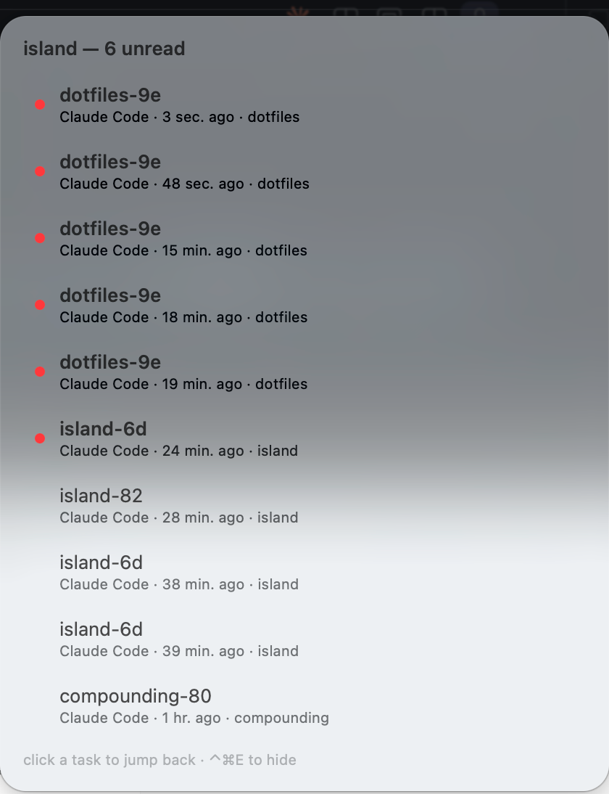
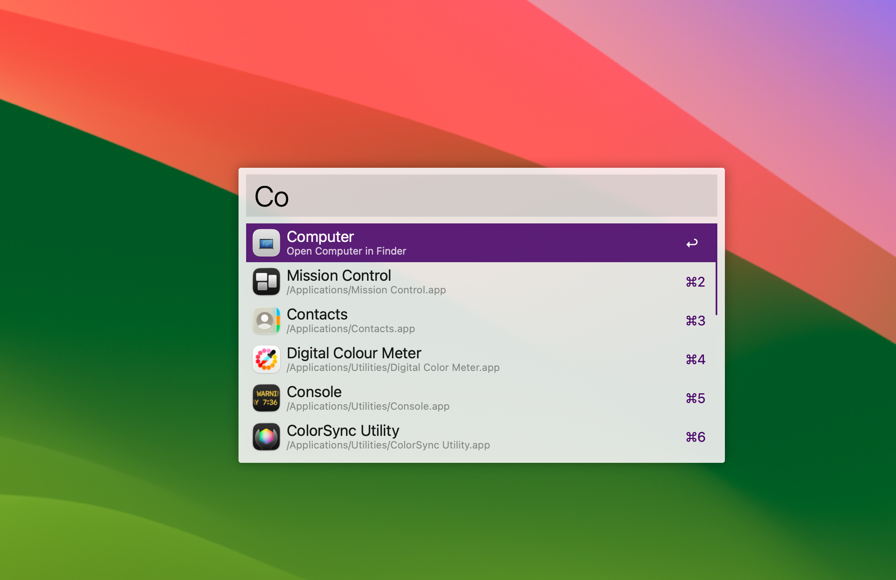
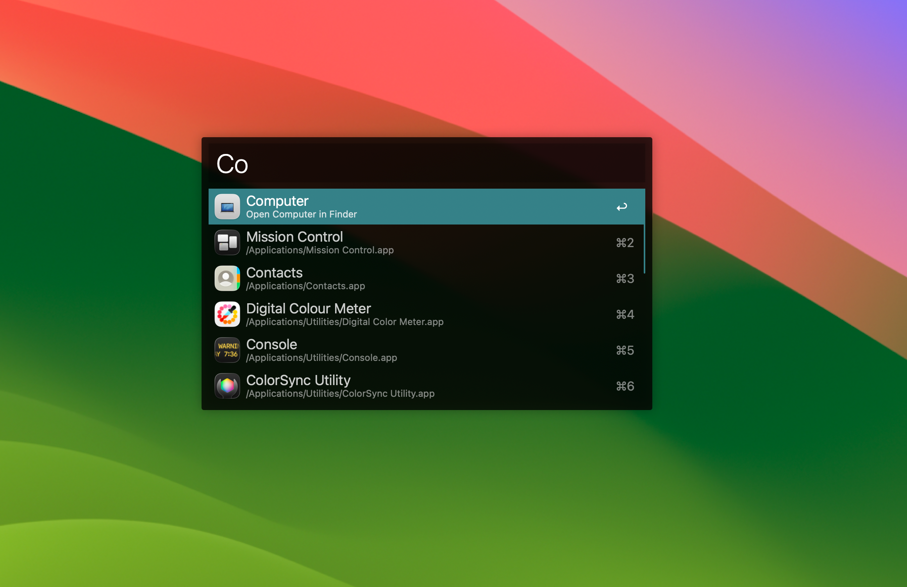
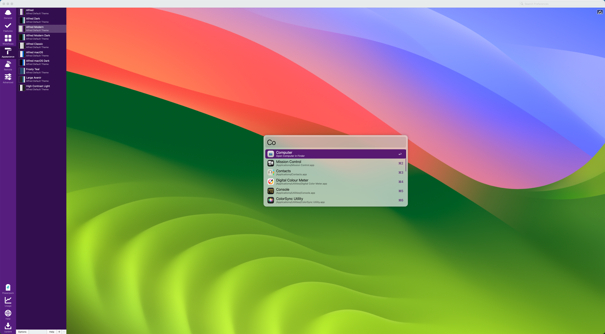
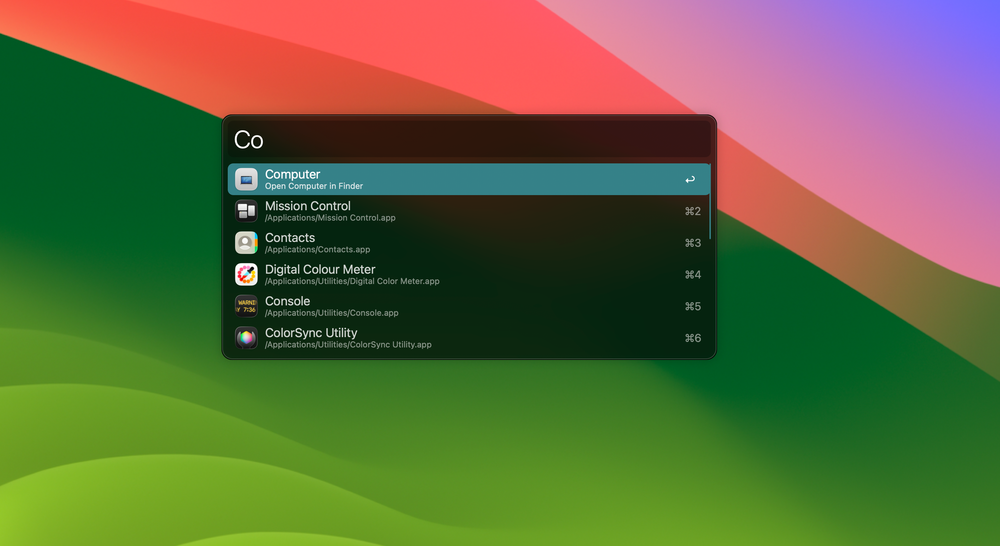

> 总纲：[ISSUES.md](../ISSUES.md)

## 背景

我想对 island dropdown 进行一次大的升级：

参考 alfred 的ux：

## 期望结果

我希望在 settings 里也有这些风格的支持。

## 备注

- 全程在独立 worktree（`../.worktree/<repo>-<slug>`）中完成，合回 master 前 `make verify` 全过，流程见 AGENTS.md / Workflow / Worktree 与 Ship

## Decision

2026-09-25，用户（binyan.li）在会话中确认：

1. **键盘交互**：热键（及菜单 `Summon overlay`）召唤时悬浮窗成为 key window，可 ↑↓ 选择、Enter 打开、⌘1–9 直达、Esc 关闭、顶部输入框按标题/目录/agent 过滤；任务完成**自动弹出时仍然不抢焦点**，只能鼠标点击
2. **主题**：settings 里提供一组 Alfred 式预设：System（跟随系统）/ Light（紫色高亮）/ Dark（青色高亮）/ Modern Dark（圆角描边）/ Frosty（毛玻璃，原风格），选中立即生效并持久化
3. **行图标**：每行左侧显示 agent 的 app 图标，未读用图标角上的小红点

Scope-check: PLAN § Design / Island 下拉框 UX、Island 展示 UX；主题设置不在 PLAN 明文内，依据用户在 issue「期望结果」与会话中的明确指令
